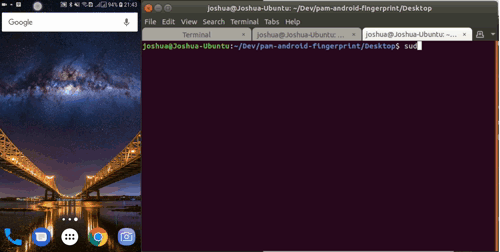

# PAM Android Fingerprint

PAM authentication module using Android fingerprint sensor

For stability please use release version

## Android

Compile and install android app using gradle

Compatible with Android 6.0 (API 23) and up  
Tested with Android 8.0 (API 26)

## Desktop

Tested on Ubuntu 18.04

### Dependencies

`sudo apt install python-pyotp python-pam python-requests`

### Setting up
 1. Copy `setup,py` and `main.py` to the same folder
 2. Edit PAM configuration file (usually located under `/etc/pam.d/`)
 3. Add auth entry (`auth <pam control flag> pam_python.so <location of main.py>`)
 4. Run `setup.py -f` for first time setup (make sure the Android server is running)

## Usage

## Roadmap

- v0.2
  - Faster phone detection
  - Android cleanup
  - Add setup error detection
- v0.3
  - Overhaul Android UI
  - Add setting
- v0.4
  - Support for multiuser
  - Better authentication method